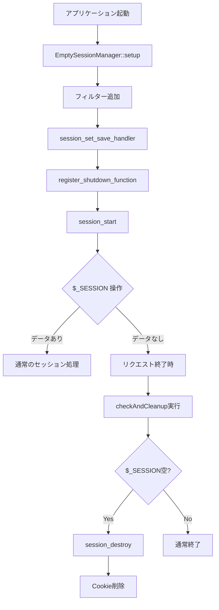

# 空セッション管理機能（PreventEmptySessionCookie）実装仕様書

> **📝 命名に関する注記**
> この実装仕様書の初版では `EmptySessionManager` というクラス名で記載していましたが、最終的に **`PreventEmptySessionCookie`** という名前に変更することになりました。
>
> **実装時の対応:**
> - クラス名: `EmptySessionManager` → `PreventEmptySessionCookie`
> - ファイル名: `EmptySessionManager.php` → `PreventEmptySessionCookie.php`
> - テストファイル名: `EmptySessionManagerTest.php` → `PreventEmptySessionCookieTest.php`
>
> このドキュメント内では元の名前のまま記載されている箇所がありますが、実装時には上記の新しい名前を使用してください。

## 1. 背景と課題

### 現状の問題

現在のライブラリには `WriteFilterInterface` を使用して、空のセッションデータをRedisに書き込まないフィルター機能が実装されている。しかし、以下の問題が存在する：

- **WriteFilterがRedisへの書き込みをキャンセル** → ✅ 実装済み
- **PHPのセッション機構自体は動作し続ける** → ❌ 未対応
- **セッションIDが発行され、Cookieがクライアントに送信される** → ❌ 未対応

### 問題の影響

```text
1. session_start() → セッションID生成 → Cookie送信
2. $_SESSION が空の場合 → WriteFilterがRedis書き込みキャンセル
3. 次回アクセス時 → CookieのセッションIDでRedisを確認 → 存在しない → 無駄な通信
```

この無駄な通信を削減し、パフォーマンスを向上させる必要がある。

## 2. 解決方針

### 検討した方法と採用理由

議論の結果、以下の方法を採用する：

**方法C: NoEmptyCookieSession パターン**

#### 採用理由

1. **アプリケーションコードの変更が最小限**
   - `$_SESSION` を使うコードは一切変更不要
   - `session_start()` の前に1行追加するだけ

2. **PHPの公式機能を使用**
   - `session_destroy()` による正規のセッション破棄
   - 未定義動作やヘッダー操作のハックに依存しない

3. **安定性と予測可能性**
   - PHPのセッションライフサイクルに逆らわない
   - 他のミドルウェアやフレームワークとの相互作用が単純

#### トレードオフ

- 最初の空リクエストでは一度Cookieが発行されるが、即座に削除される
- 実用上は問題にならないレベルのオーバーヘッド

## 3. 実装仕様

### 3.1 基本動作

1. セッション開始前に `EmptySessionManager::setup()` を呼び出し
2. 空セッションフィルターをハンドラーに追加
3. リクエスト終了時に `register_shutdown_function` で登録したコールバックが実行
4. セッションが空の場合、`session_destroy()` でセッションを破棄し、Cookieも削除

### 3.2 ファイル構成

```text
src/
  Hook/
    EmptySessionFilter.php        # 空セッションフィルター
  Session/
    EmptySessionManager.php        # Cookie制御マネージャー

tests/
  Hook/
    EmptySessionFilterTest.php    # フィルターのテスト
  Session/
    EmptySessionManagerTest.php   # マネージャーのテスト

examples/
  06-empty-session-no-cookie.php  # 使用例
```

## 4. 実装詳細

### 4.1 EmptySessionFilter クラス

```php
namespace Uzulla\EnhancedRedisSessionHandler\Hook;

class EmptySessionFilter implements WriteFilterInterface
{
    private LoggerInterface $logger;
    private bool $lastWriteWasEmpty = false;

    public function __construct(LoggerInterface $logger);
    public function shouldWrite(string $sessionId, array $data): bool;
    public function wasLastWriteEmpty(): bool;
}
```

**責務:**
- セッションデータが空かどうかを判定
- 空の場合はRedisへの書き込みをキャンセル
- ログ出力

### 4.2 EmptySessionManager クラス

```php
namespace Uzulla\EnhancedRedisSessionHandler\Session;

class EmptySessionManager
{
    private static bool $initialized = false;
    private static ?EmptySessionFilter $filter = null;

    public static function setup(
        RedisSessionHandler $handler,
        LoggerInterface $logger
    ): void;

    public static function checkAndCleanup(): void;
    public static function reset(): void;
}
```

**責務:**
- セッションハンドラーの設定
- 空セッションフィルターの追加
- リクエスト終了時のクリーンアップ処理の登録
- 空セッション時のCookie削除

### 4.3 動作フロー



## 5. 使用方法

### 5.1 基本的な使い方

```php
// セッションハンドラーの設定
$factory = new SessionHandlerFactory($sessionConfig);
$handler = $factory->build();

// EmptySessionManagerでセットアップ（この1行を追加）
EmptySessionManager::setup($handler, $logger);

// 通常通りセッションを開始
session_start();

// 以降、アプリケーションコードは変更不要
$_SESSION['user_id'] = 123;  // 通常通り動作
```

### 5.2 既存システムへの適用

既存のコードで `session_set_save_handler()` と `session_start()` を呼んでいる箇所を以下のように変更：

**変更前:**

```php
session_set_save_handler($handler, true);
session_start();
```

**変更後:**

```php
EmptySessionManager::setup($handler, $logger);
session_start();
```

## 6. テスト方針

### 6.1 単体テスト

#### EmptySessionFilterTest
- `shouldWrite()` が空配列でfalseを返すことを確認
- `shouldWrite()` がデータありでtrueを返すことを確認
- `wasLastWriteEmpty()` の状態管理を確認

#### EmptySessionManagerTest
- `setup()` の重複呼び出し防止を確認
- `checkAndCleanup()` が適切に動作することを確認
- `reset()` で状態がクリアされることを確認

### 6.2 統合テスト

- 空セッションでCookieが送信されないことを確認
- データありセッションで正常にCookieが送信されることを確認
- 既存セッション（Cookie既存）の動作が変わらないことを確認

### 6.3 E2Eテスト

実際のRedisとPHPセッション機構を使用した動作確認：
- 空セッション → Redis書き込みなし、Cookie削除
- データありセッション → Redis書き込み、Cookie送信
- 既存セッションの読み取り → 正常動作

## 7. 設定オプション（将来の拡張案）

### SessionConfigへの統合（オプション）

```php
class SessionConfig
{
    private bool $preventEmptySessionCookie = false;

    public function setPreventEmptySessionCookie(bool $prevent): self;
    public function shouldPreventEmptySessionCookie(): bool;
}
```

この設定により、機能のON/OFFを制御可能にする。

## 8. 後方互換性

### 影響範囲

- **既存のアプリケーションコード**: 影響なし（`$_SESSION` の使用方法は変更不要）
- **既存のセッションデータ**: 影響なし（既存のセッションは正常に読み取り可能）
- **既存の設定**: 影響なし（オプトイン方式のため、明示的に有効化しない限り動作しない）

### PHP バージョン互換性

- PHP 7.4 ～ 8.4 で動作確認
- 使用する PHP 機能はすべて PHP 7.4 で利用可能

## 9. セキュリティ考慮事項

- セッションIDのログ出力時は必ずマスキング（`SessionIdMasker::mask()`）を使用
- Cookie削除時は `httponly` と `secure` フラグを適切に設定
- `session_destroy()` により確実にセッションデータを破棄

## 10. パフォーマンスへの影響

### 改善される点

- 空セッションのRedis書き込みが削減される
- 次回アクセス時の無駄なRedis確認が削減される
- ネットワークトラフィックの削減

### オーバーヘッド

- `register_shutdown_function` の実行（無視できるレベル）
- 最初の空リクエストでの Cookie 送信→削除（1往復のみ）

## 11. ドキュメント更新

以下のドキュメントに機能説明を追加：

- README.md: 機能概要と基本的な使い方
- doc/factory-usage.md: ファクトリー経由での設定方法
- examples/README.md: サンプルコードの説明

## 12. リリースノート案

```markdown
### 新機能: 空セッションのCookie制御

空のセッションデータの場合、Cookieを送信しない機能を追加しました。
これにより、不要なセッションIDの生成とRedisへのアクセスを削減できます。

**使用方法:**
```php
EmptySessionManager::setup($handler, $logger);
session_start();
```

この機能はオプトイン方式のため、既存のコードには影響しません。
```


