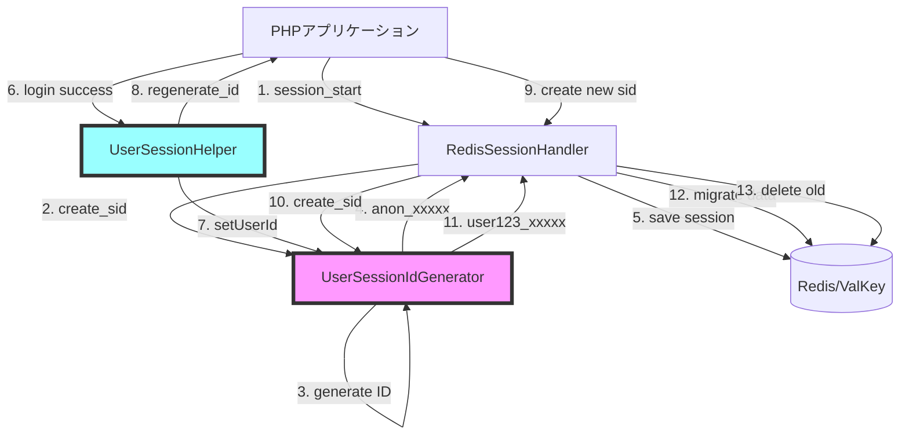
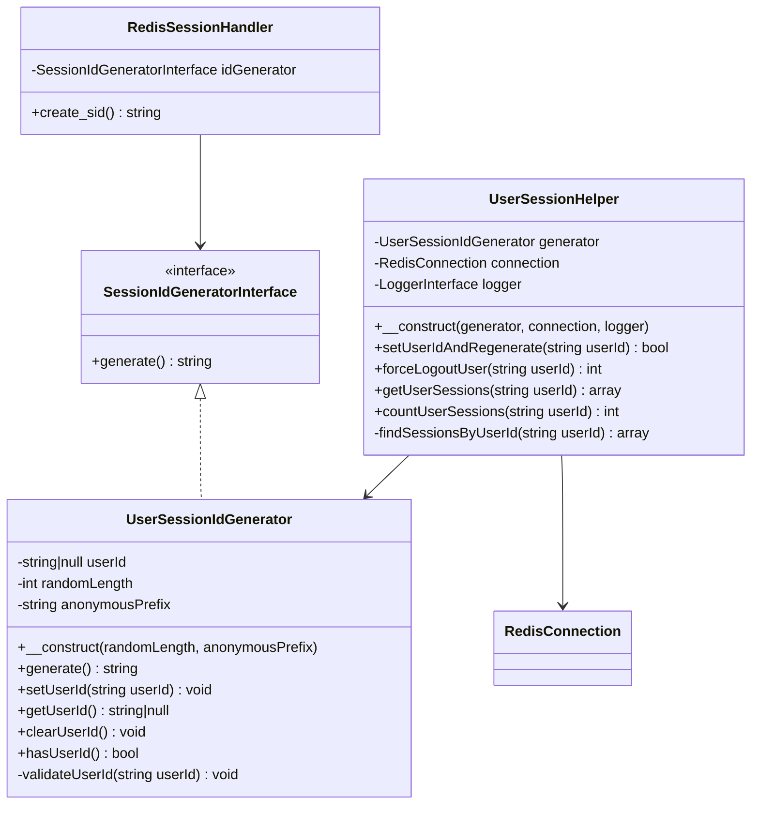
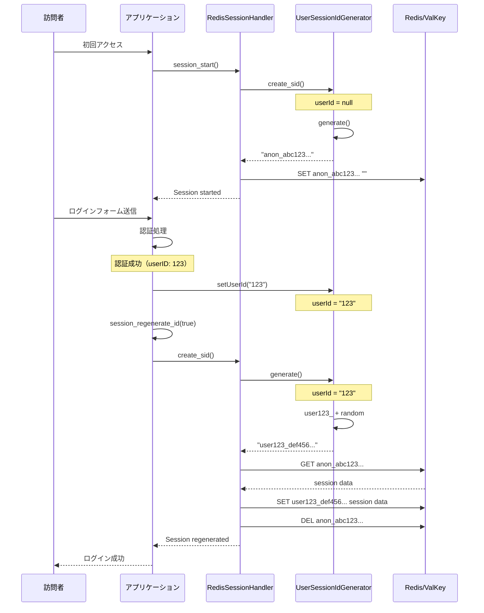
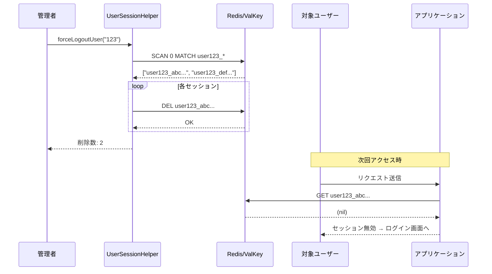

# ユーザーID Prefix付きセッションID生成プラグイン 設計書

## 目次

1. [概要](#概要)
2. [ユースケース](#ユースケース)
3. [アーキテクチャ](#アーキテクチャ)
4. [シーケンス図](#シーケンス図)
5. [API設計](#api設計)
6. [セキュリティ考慮事項](#セキュリティ考慮事項)
7. [実装計画](#実装計画)
8. [テスト計画](#テスト計画)

---

## 概要

### 目的

ユーザーIDをセッションIDのプレフィックスとして持つことで、以下の機能を実現する：

- **ユーザー単位のセッション管理**: 特定ユーザーの全セッションを特定できる
- **強制ログアウト機能**: 管理者が特定ユーザーの全セッションを無効化できる
- **セキュアなセッション管理**: ログイン時のセッションID再生成によるセッションフィクセーション攻撃対策

### 課題と解決方法

**課題**: ユーザーIDが確定するのはsession_start後（ログイン認証後）である

**解決方法**:
1. 初期セッションIDは匿名プレフィックス（例: `anon_xxxxx`）で生成
2. ログイン成功時にユーザーIDを設定し、セッションIDを再生成（例: `user123_xxxxx`）
3. セッションデータは自動的に新しいセッションIDに移行

---

## ユースケース

### 1. 通常のログインフロー

```
訪問者 → session_start() → anon_abc123...
       ↓
       ログインフォーム表示
       ↓
       認証成功（ユーザーID: 123）
       ↓
       setUserId(123) → セッションID再生成 → user123_def456...
       ↓
       ログイン後の画面表示
```

### 2. 強制ログアウト（管理機能）

```
管理者 → forceLogoutUser(123)
       ↓
       Redis検索: user123_* パターンのキーを全削除
       ↓
       ユーザー123の全セッションが無効化
       ↓
       次回アクセス時、ユーザー123は再ログインが必要
```

### 3. セッション監査

```
管理者 → getUserSessions(123)
       ↓
       Redis検索: user123_* パターンのキーを取得
       ↓
       ユーザー123のアクティブセッション一覧
       （IPアドレス、最終アクセス時刻など）
```

---

## アーキテクチャ

### コンポーネント構成



### クラス図



---

## シーケンス図

### シナリオ1: 初回訪問からログインまで



### シナリオ2: 強制ログアウト



---

## API設計

### UserSessionIdGenerator クラス

#### コンストラクタ

```php
/**
 * @param int $randomLength ランダム部分の長さ（16進数文字列、偶数、デフォルト: 32）
 * @param string $anonymousPrefix 匿名セッションのプレフィックス（デフォルト: 'anon'）
 * @throws InvalidArgumentException
 */
public function __construct(
    int $randomLength = 32,
    string $anonymousPrefix = 'anon'
)
```

**バリデーション**:
- `$randomLength`: 16以上256以下の偶数
- `$anonymousPrefix`: 空文字列不可、英数字とハイフンのみ、64文字以下

#### セッションID生成

```php
/**
 * セッションIDを生成
 *
 * ユーザーIDが設定されている場合: "user{userId}_{random}"
 * 未設定の場合: "{anonymousPrefix}_{random}"
 *
 * @return string
 */
public function generate(): string
```

**生成パターン**:
- ユーザーID未設定: `anon_a1b2c3d4...`
- ユーザーID設定済み（例: "123"）: `user123_a1b2c3d4...`

#### ユーザーID設定

```php
/**
 * ユーザーIDを設定
 *
 * この後、アプリケーション側でsession_regenerate_id(true)を呼び出す必要がある
 *
 * @param string $userId ユーザーID（数字または英数字、64文字以下）
 * @throws InvalidArgumentException ユーザーIDが無効な場合
 * @return void
 */
public function setUserId(string $userId): void
```

**バリデーション**:
- 空文字列不可
- 英数字とハイフン、アンダースコアのみ
- 64文字以下
- `anon` または `user` で始まらない（プレフィックスの予約語）

#### その他のメソッド

```php
/**
 * 現在設定されているユーザーIDを取得
 *
 * @return string|null 未設定の場合はnull
 */
public function getUserId(): ?string

/**
 * ユーザーIDが設定されているかチェック
 *
 * @return bool
 */
public function hasUserId(): bool

/**
 * ユーザーIDをクリア（ログアウト時に使用）
 *
 * @return void
 */
public function clearUserId(): void
```

### UserSessionHelper クラス

#### コンストラクタ

```php
/**
 * @param UserSessionIdGenerator $generator
 * @param RedisConnection $connection
 * @param LoggerInterface $logger
 */
public function __construct(
    UserSessionIdGenerator $generator,
    RedisConnection $connection,
    LoggerInterface $logger
)
```

#### ユーザーID設定とセッション再生成

```php
/**
 * ユーザーIDを設定し、セッションIDを再生成
 *
 * この1つのメソッドで以下を実行：
 * 1. ユーザーIDをジェネレータに設定
 * 2. session_regenerate_id(true)を実行
 * 3. ログ記録
 *
 * @param string $userId
 * @return bool 成功した場合true
 * @throws InvalidArgumentException ユーザーIDが無効な場合
 */
public function setUserIdAndRegenerate(string $userId): bool
```

**使用例**:
```php
// ログイン成功後
$helper->setUserIdAndRegenerate('123');
```

#### 強制ログアウト

```php
/**
 * 特定ユーザーの全セッションを強制削除
 *
 * user{userId}_* パターンのRedisキーを全て削除
 *
 * @param string $userId
 * @return int 削除されたセッション数
 */
public function forceLogoutUser(string $userId): int
```

**使用例**:
```php
// 管理機能
$deletedCount = $helper->forceLogoutUser('123');
echo "削除されたセッション数: {$deletedCount}";
```

#### セッション一覧取得

```php
/**
 * 特定ユーザーのアクティブセッション一覧を取得
 *
 * @param string $userId
 * @return array<string, array{
 *     session_id: string,
 *     created_at: int|null,
 *     last_access: int|null,
 *     data_size: int
 * }>
 */
public function getUserSessions(string $userId): array
```

**戻り値例**:
```php
[
    'user123_abc...' => [
        'session_id' => '...abc',  // マスキング済み
        'created_at' => 1699999999,
        'last_access' => 1700000100,
        'data_size' => 256
    ],
    'user123_def...' => [
        'session_id' => '...def',
        'created_at' => 1700000000,
        'last_access' => 1700000200,
        'data_size' => 512
    ]
]
```

#### セッション数カウント

```php
/**
 * 特定ユーザーのアクティブセッション数を取得
 *
 * @param string $userId
 * @return int
 */
public function countUserSessions(string $userId): int
```

---

## セキュリティ考慮事項

### 1. セッションフィクセーション攻撃対策

**問題**: 攻撃者が事前に知っているセッションIDでログインされる脆弱性

**対策**:
- ログイン成功時に必ず `session_regenerate_id(true)` を実行
- 古いセッションID（`anon_xxx`）は削除される
- 新しいセッションID（`user123_xxx`）は予測不可能

**実装**:
```php
// ログイン処理
if ($auth->authenticate($username, $password)) {
    $helper->setUserIdAndRegenerate($auth->getUserId());
    // ↑ この中で session_regenerate_id(true) が実行される
}
```

### 2. セッションIDのログ出力

**問題**: セッションIDがログに記録されると、ログ漏洩時にセッションハイジャックのリスク

**対策**:
- 全てのログ出力でセッションIDをマスキング
- `SessionIdMasker::mask()` を使用
- 末尾4文字のみ表示（例: `...abc1`）

**実装**:
```php
$this->logger->info('User session regenerated', [
    'user_id' => $userId,
    'old_session_id' => SessionIdMasker::mask($oldSessionId),
    'new_session_id' => SessionIdMasker::mask($newSessionId),
]);
```

### 3. ユーザーID検証

**問題**: 不正なユーザーIDによるセッションID汚染

**対策**:
- ユーザーIDの厳密なバリデーション
- 予約語（`anon`, `user`）の禁止
- 長さ制限（64文字以下）
- 文字種制限（英数字、ハイフン、アンダースコアのみ）

**実装**:
```php
private function validateUserId(string $userId): void
{
    if ($userId === '') {
        throw new InvalidArgumentException('User ID cannot be empty');
    }
    if (strlen($userId) > 64) {
        throw new InvalidArgumentException('User ID too long (max 64 chars)');
    }
    if (preg_match('/^[a-zA-Z0-9_-]+$/', $userId) !== 1) {
        throw new InvalidArgumentException('Invalid user ID format');
    }
    if (preg_match('/^(anon|user)/', $userId) === 1) {
        throw new InvalidArgumentException('User ID cannot start with reserved prefix');
    }
}
```

### 4. Redis SCAN の安全な使用

**問題**: `KEYS` コマンドは本番環境でブロッキングが発生

**対策**:
- `SCAN` コマンドを使用（非ブロッキング）
- カーソルベースのイテレーション
- マッチパターン指定

**実装**:
```php
private function findSessionsByUserId(string $userId): array
{
    $pattern = "user{$userId}_*";
    $sessions = [];
    $cursor = 0;

    do {
        $result = $this->connection->scan($cursor, $pattern, 100);
        $cursor = $result[0];
        $keys = $result[1];

        foreach ($keys as $key) {
            $sessions[] = $key;
        }
    } while ($cursor !== 0);

    return $sessions;
}
```

### 5. タイミング攻撃対策

**問題**: レスポンス時間からユーザーの存在を推測される

**対策**:
- `forceLogoutUser()` は存在しないユーザーでも同じ処理時間
- ユーザーIDの検証を先に実行
- ダミー処理は追加しない（実装の複雑さを避ける）

### 6. 権限チェック

**重要**: `UserSessionHelper` の管理機能（強制ログアウトなど）を呼び出す前に、アプリケーション層で必ず権限チェックを実施してください。

```php
// 悪い例
$helper->forceLogoutUser($_GET['user_id']); // 危険！

// 良い例
if (!$currentUser->isAdmin()) {
    throw new UnauthorizedException();
}
$helper->forceLogoutUser($targetUserId);
```

---

## 実装計画

### Phase 1: コア実装

1. **UserSessionIdGenerator クラス**
   - ファイル: `src/SessionId/UserSessionIdGenerator.php`
   - 実装: 基本的なID生成ロジック
   - テスト: `tests/SessionId/UserSessionIdGeneratorTest.php`

2. **UserSessionHelper クラス**
   - ファイル: `src/UserSessionHelper.php`
   - 実装: セッション管理機能
   - テスト: `tests/UserSessionHelperTest.php`

### Phase 2: 統合テスト

1. **統合テスト**
   - ファイル: `tests/Integration/UserSessionIntegrationTest.php`
   - シナリオ:
     - 初回訪問 → ログイン → セッションID変更
     - 強制ログアウト
     - セッション一覧取得

### Phase 3: E2Eテスト

1. **E2Eテスト**
   - ファイル: `tests/E2E/UserSessionE2ETest.php`
   - シナリオ:
     - 実際のRedis環境での動作確認
     - 複数セッションの同時処理
     - 大量セッションでのパフォーマンス

### Phase 4: ドキュメント

1. **使用例**
   - ファイル: `examples/user_session_example.php`
   - 内容: 実際の使用方法のデモコード

2. **README更新**
   - UserSessionIdGeneratorの説明を追加
   - ユースケースの追加

### Phase 5: 静的解析とコードスタイル

1. **PHPStan**: レベル最大 + strict rules
2. **PHP CS Fixer**: PSR-12準拠
3. **カバレッジ**: 90%以上を目標

---

## テスト計画

### ユニットテスト

#### UserSessionIdGeneratorTest

```php
testGenerateWithoutUserId()              // anon_xxx 形式
testGenerateWithUserId()                  // user123_xxx 形式
testSetUserId()                          // ユーザーID設定
testSetUserIdWithInvalidId()             // バリデーションエラー
testSetUserIdWithReservedPrefix()        // 予約語エラー
testGetUserId()                          // 取得
testHasUserId()                          // 存在チェック
testClearUserId()                        // クリア
testConstructorWithInvalidRandomLength() // 不正な長さ
testConstructorWithInvalidPrefix()       // 不正なプレフィックス
```

#### UserSessionHelperTest

```php
testSetUserIdAndRegenerate()          // セッション再生成
testForceLogoutUser()                 // 強制ログアウト
testForceLogoutUserWithNoSessions()   // セッションが存在しない場合
testGetUserSessions()                 // セッション一覧
testGetUserSessionsWithNoSessions()   // セッションが存在しない場合
testCountUserSessions()               // セッション数カウント
```

### 統合テスト

#### UserSessionIntegrationTest

```php
testLoginFlowWithSessionRegeneration()    // ログインフロー全体
testMultipleSessionsForSameUser()         // 同一ユーザーの複数セッション
testForceLogoutDeletesAllUserSessions()   // 強制ログアウトの動作確認
testSessionDataPreservedAfterRegeneration() // データ移行の確認
```

### E2Eテスト

#### UserSessionE2ETest

```php
testCompleteUserJourney()               // 訪問→ログイン→操作→ログアウト
testAdminForceLogoutScenario()          // 管理者による強制ログアウト
testConcurrentSessionsHandling()        // 並行セッションの処理
testPerformanceWithManyUserSessions()   // 大量セッションのパフォーマンス
```

### テストカバレッジ目標

- **ユニットテスト**: 100%（条件分岐、例外処理を含む）
- **統合テスト**: 主要シナリオをカバー
- **E2Eテスト**: 実運用シナリオをカバー

---

## 使用例

### 基本的な使用方法

```php
use Uzulla\EnhancedRedisSessionHandler\SessionId\UserSessionIdGenerator;
use Uzulla\EnhancedRedisSessionHandler\UserSessionHelper;

// 1. ジェネレータのセットアップ
$generator = new UserSessionIdGenerator();

// 2. SessionHandlerに設定
$config = new SessionConfig(
    new RedisConnectionConfig(),
    $generator,  // ← UserSessionIdGenerator
    1440,
    new NullLogger()
);
$factory = new SessionHandlerFactory($config);
$handler = $factory->build();
session_set_save_handler($handler, true);

// 3. Helperの作成
$helper = new UserSessionHelper(
    $generator,
    $handler->getConnection(),  // RedisConnection
    new NullLogger()
);

// 4. セッション開始（匿名）
session_start();
// セッションID: anon_a1b2c3d4...

// 5. ログイン処理
if ($_SERVER['REQUEST_METHOD'] === 'POST') {
    if (authenticate($_POST['username'], $_POST['password'])) {
        $userId = getUserIdByUsername($_POST['username']);

        // ユーザーIDを設定してセッションID再生成
        $helper->setUserIdAndRegenerate($userId);
        // セッションID: user123_e5f6g7h8...

        $_SESSION['user_id'] = $userId;
        header('Location: /dashboard');
        exit;
    }
}
```

### 管理機能の使用方法

```php
// 管理者ページで特定ユーザーを強制ログアウト
if ($currentUser->isAdmin()) {
    $targetUserId = $_POST['target_user_id'];

    // アクティブセッション数を確認
    $sessionCount = $helper->countUserSessions($targetUserId);
    echo "対象ユーザーのアクティブセッション数: {$sessionCount}\n";

    // 全セッションを削除
    $deletedCount = $helper->forceLogoutUser($targetUserId);
    echo "削除されたセッション数: {$deletedCount}\n";
}

// セッション監査: ユーザーのアクティブセッション一覧
if ($currentUser->isAdmin()) {
    $sessions = $helper->getUserSessions('123');

    foreach ($sessions as $sessionKey => $info) {
        echo "セッションID: {$info['session_id']}\n";
        echo "作成日時: " . date('Y-m-d H:i:s', $info['created_at']) . "\n";
        echo "最終アクセス: " . date('Y-m-d H:i:s', $info['last_access']) . "\n";
        echo "データサイズ: {$info['data_size']} bytes\n";
        echo "---\n";
    }
}
```

### ログアウト処理

```php
// 通常のログアウト
session_start();
session_destroy();

// または、ジェネレータをクリアして匿名に戻す
$generator->clearUserId();
session_regenerate_id(true);
// セッションID: anon_xxxxx に戻る
```

---

## 参考資料

- [OWASP Session Management Cheat Sheet](https://cheatsheetseries.owasp.org/cheatsheets/Session_Management_Cheat_Sheet.html)
- [PHP Session Security Best Practices](https://www.php.net/manual/en/session.security.php)
- [Redis SCAN command](https://redis.io/commands/scan/)

---

## 変更履歴

| 日付 | バージョン | 変更内容 |
|------|-----------|---------|
| 2025-11-12 | 1.0.0 | 初版作成 |
