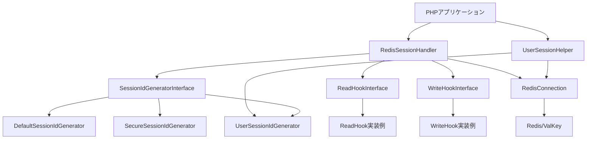
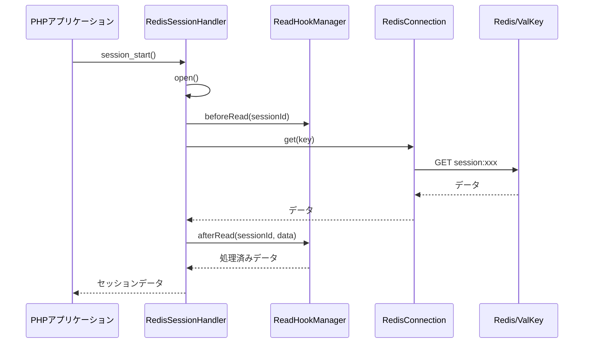
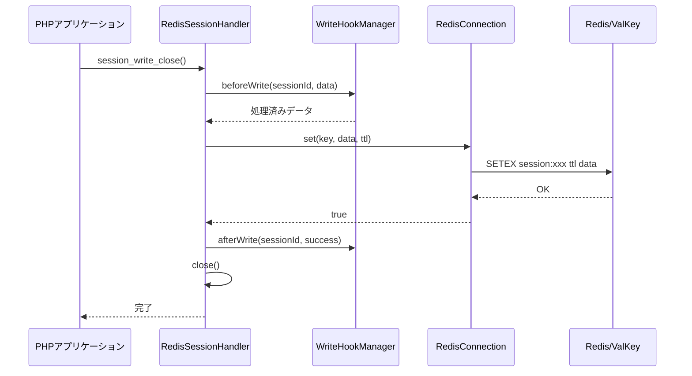
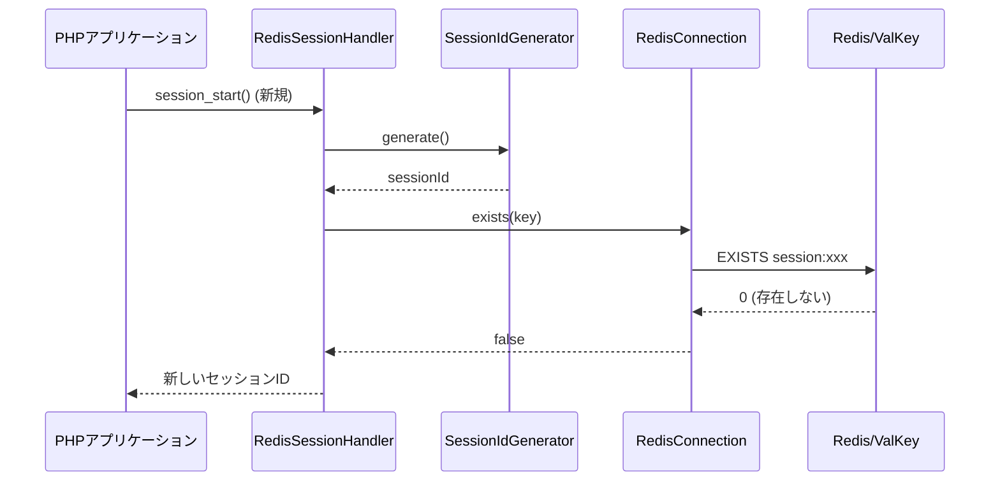
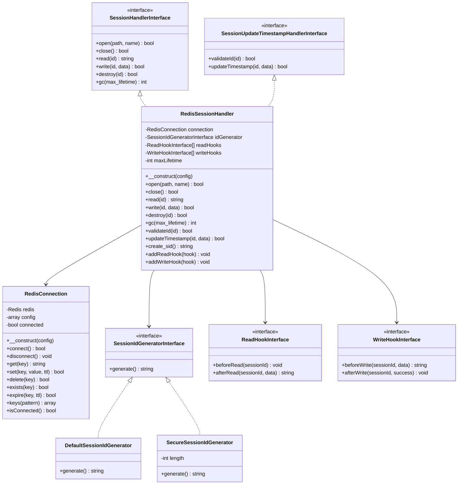

# システムアーキテクチャ設計書

## 1. プロジェクト概要

### 1.1 目的
enhanced-redis-session-handler.phpは、PHPのセッション管理をRedis/ValKeyを使用して実装する拡張可能なセッションハンドラライブラリです。標準的なRedisセッションハンドラに加えて、プラグイン機構とフック機能を提供することで、カスタマイズ性と拡張性を高めています。

### 1.2 主要な特徴
- **SessionHandlerInterface準拠**: PHPの標準セッションハンドラインターフェースを完全実装
- **プラグイン可能なセッションIDジェネレータ**: セッションID生成ロジックをカスタマイズ可能
- **フック機構**: セッションの読み込み・書き込み時に任意の処理を挿入可能
- **Redis/ValKey対応**: ext-redisを使用した高速なセッションストレージ
- **拡張性**: 新しい機能を容易に追加できる設計

### 1.3 対象ユーザー
- 水平スケーリングが必要なPHPアプリケーション開発者
- セッション管理をカスタマイズしたい開発者
- 高可用性が求められるWebサービスの運用者

## 2. アーキテクチャ概要

### 2.1 レイヤー構成

```
┌─────────────────────────────────────────────────────┐
│           PHPアプリケーション層                        │
│  (session_start(), $_SESSION, session_write_close()) │
└─────────────────────────────────────────────────────┘
                         ↓
┌─────────────────────────────────────────────────────┐
│         セッションハンドラ層                           │
│  ┌─────────────────────────────────────────────┐   │
│  │      RedisSessionHandler                     │   │
│  │  (SessionHandlerInterface実装)               │   │
│  └─────────────────────────────────────────────┘   │
│           ↓              ↓              ↓            │
│  ┌──────────────┐ ┌──────────┐ ┌──────────────┐   │
│  │SessionId     │ │Read Hook │ │Write Hook    │   │
│  │Generator     │ │Manager   │ │Manager       │   │
│  └──────────────┘ └──────────┘ └──────────────┘   │
└─────────────────────────────────────────────────────┘
                         ↓
┌─────────────────────────────────────────────────────┐
│           Redis接続管理層                             │
│  ┌─────────────────────────────────────────────┐   │
│  │      RedisConnection                         │   │
│  │  (接続管理、エラーハンドリング)                 │   │
│  └─────────────────────────────────────────────┘   │
└─────────────────────────────────────────────────────┘
                         ↓
┌─────────────────────────────────────────────────────┐
│              Redis/ValKey                            │
│         (セッションデータストレージ)                    │
└─────────────────────────────────────────────────────┘
```

### 2.2 コンポーネント間の関係



## 3. コアコンポーネント設計

### 3.1 RedisSessionHandler

#### 3.1.1 責務
- PHPのSessionHandlerInterfaceの実装
- SessionUpdateTimestampHandlerInterfaceの実装
- セッションのCRUD操作（作成、読み込み、更新、削除）
- ガベージコレクション
- フックの呼び出し管理

#### 3.1.2 主要メソッド

```php
class RedisSessionHandler implements 
    SessionHandlerInterface, 
    SessionUpdateTimestampHandlerInterface
{
    // 基本操作
    public function open(string $path, string $name): bool;
    public function close(): bool;
    public function read(string $id): string|false;
    public function write(string $id, string $data): bool;
    public function destroy(string $id): bool;
    public function gc(int $max_lifetime): int|false;
    
    // タイムスタンプ更新
    public function validateId(string $id): bool;
    public function updateTimestamp(string $id, string $data): bool;
    
    // セッションID生成
    public function create_sid(): string;
}
```

**設計上の注意点：**

このライブラリでは、`RedisSessionHandler`は`SessionHandlerInterface`を直接実装します。PHPには`SessionHandler`という抽象クラスも存在しますが、以下の理由から使用しません：

- **完全な制御**: インターフェースを直接実装することで、すべてのメソッドの動作を完全に制御できます
- **フック機構の実装**: read/writeメソッドの前後にフック処理を挿入するため、デフォルト実装に依存しない方が適切です
- **明示的な実装**: すべてのメソッドを明示的に実装することで、コードの意図が明確になります
- **柔軟性**: 将来的な拡張や変更に対して柔軟に対応できます

`SessionHandler`クラスは、ファイルベースのセッションハンドラをラップするための便利なクラスですが、Redis/ValKeyのような外部ストレージを使用する場合は、インターフェースを直接実装する方が適切です。

#### 3.1.3 依存関係
- RedisConnection: Redis接続管理
- SessionIdGeneratorInterface: セッションID生成
- ReadHookInterface[]: 読み込み時フック（複数）
- WriteHookInterface[]: 書き込み時フック（複数）

### 3.2 RedisConnection

#### 3.2.1 責務
- Redis/ValKeyへの接続管理
- 接続エラーのハンドリング
- 接続の再利用（必要に応じて接続プーリング）
- Redis操作の抽象化

#### 3.2.2 主要メソッド

```php
class RedisConnection
{
    public function __construct(array $config);
    public function connect(): bool;
    public function disconnect(): void;
    public function get(string $key): string|false;
    public function set(string $key, string $value, int $ttl): bool;
    public function delete(string $key): bool;
    public function exists(string $key): bool;
    public function expire(string $key, int $ttl): bool;
    public function keys(string $pattern): array;
    public function isConnected(): bool;
}
```

#### 3.2.3 設定パラメータ
- host: Redisサーバーのホスト名
- port: Redisサーバーのポート番号
- timeout: 接続タイムアウト
- password: 認証パスワード（オプション）
- database: データベース番号（デフォルト: 0）
- prefix: キープレフィックス（デフォルト: "session:"）

### 3.3 プラグインアーキテクチャ

#### 3.3.1 SessionIdGeneratorInterface

```php
interface SessionIdGeneratorInterface
{
    public function generate(): string;
}
```

**実装例:**
- `DefaultSessionIdGenerator`: PHPのデフォルトアルゴリズムを使用
- `SecureSessionIdGenerator`: より強力なランダム性を持つ実装

#### 3.3.2 ReadHookInterface

```php
interface ReadHookInterface
{
    public function beforeRead(string $sessionId): void;
    public function afterRead(string $sessionId, string $data): string;
}
```

**用途例:**
- セッションデータの復号化
- アクセスログの記録
- データの検証

#### 3.3.3 WriteHookInterface

```php
interface WriteHookInterface
{
    public function beforeWrite(string $sessionId, string $data): string;
    public function afterWrite(string $sessionId, bool $success): void;
}
```

**用途例:**
- セッションデータの暗号化
- データの圧縮
- 監査ログの記録

#### 3.3.4 UserSessionIdGenerator

**目的:** ユーザーIDをセッションIDのプレフィックスとして使用し、ユーザー単位のセッション管理を実現します。

**クラス構造:**
```php
class UserSessionIdGenerator implements SessionIdGeneratorInterface
{
    private ?string $userId = null;
    private int $randomLength;
    private string $anonymousPrefix;

    public function __construct(int $randomLength = 32, string $anonymousPrefix = 'anon');
    public function generate(): string;
    public function setUserId(string $userId): void;
    public function getUserId(): ?string;
    public function hasUserId(): bool;
    public function clearUserId(): void;
}
```

**セッションIDフォーマット:**
- **匿名セッション**: `{anonymousPrefix}_{random}` (例: `anon_abc123...`)
- **ユーザーセッション**: `user{userId}_{random}` (例: `user123_def456...`)

**設計上の特徴:**
1. **状態管理**: ユーザーIDをインスタンス変数として保持
2. **ログイン時の再生成**: setUserId()とsession_regenerate_id()を組み合わせて使用
3. **パターンマッチング**: セッションIDのプレフィックスによりユーザーのセッションを特定可能
4. **バリデーション**: ユーザーIDの文字種制限、予約語チェックを実装

**セキュリティ考慮事項:**
- セッションフィクセーション攻撃対策（ログイン時に必ずID再生成）
- 予約語（`anon`, `user`）で始まるユーザーIDを拒否
- ランダム部分は暗号学的に安全な乱数生成

**使用フロー:**
```
1. 初回訪問 → session_start() → anon_xxx
2. ログイン成功 → setUserId('123') → session_regenerate_id() → user123_yyy
3. ログアウト → clearUserId() → (オプション: セッション再生成 → anon_zzz)
```

#### 3.3.5 UserSessionHelper

**目的:** UserSessionIdGeneratorと連携して、ユーザー単位のセッション管理機能を提供します。

**クラス構造:**
```php
class UserSessionHelper
{
    private UserSessionIdGenerator $generator;
    private RedisConnection $connection;
    private LoggerInterface $logger;

    public function __construct(
        UserSessionIdGenerator $generator,
        RedisConnection $connection,
        LoggerInterface $logger
    );

    public function setUserIdAndRegenerate(string $userId): bool;
    public function forceLogoutUser(string $userId): int;
    public function getUserSessions(string $userId): array;
    public function countUserSessions(string $userId): int;
}
```

**責務:**
1. **セッションID再生成の管理**: ログイン時のセッションID再生成を一括処理
2. **強制ログアウト**: 特定ユーザーの全セッションを削除
3. **セッション監査**: ユーザーのアクティブセッション一覧取得
4. **ログ記録**: セッション操作のログ記録（SessionIdMaskerでマスキング）

**設計パターン:**
- **ヘルパークラス**: UserSessionIdGeneratorとRedisConnectionを協調させる
- **ファサードパターン**: 複雑な操作を単純なインターフェースで提供
- **関心の分離**: セッション管理ロジックをアプリケーションコードから分離

**Redis操作:**
- **SCAN使用**: KEYSコマンドの代わりにSCANを使用（本番環境でのブロッキング回避）
- **パターンマッチング**: `user{userId}_*` パターンでセッションを検索
- **バッチ処理**: デフォルトバッチサイズ100で効率的に処理

**セキュリティ考慮事項:**
1. **権限チェック**: forceLogoutUser()呼び出し前に必ず権限チェックを実施
2. **セッションIDマスキング**: 全ログ出力でSessionIdMasker::mask()を自動適用
3. **タイミング攻撃対策**: 存在しないユーザーでも同じ処理時間
4. **エラーハンドリング**: 部分的な失敗を適切にログ記録

**アーキテクチャ上の位置づけ:**
```
PHPアプリケーション
    ↓
UserSessionHelper (ヘルパー層)
    ↓              ↓
UserSessionId    RedisConnection
Generator         (データアクセス層)
(ID生成層)          ↓
                Redis/ValKey
```

**詳細設計:** `doc/UserSessionIdGenerator/design.md` を参照

### 3.4 SessionHandlerFactory

#### 3.4.1 責務
- `RedisSessionHandler`のインスタンス生成
- `SessionConfig`に基づく設定の適用
- 依存関係の注入とワイヤリング

#### 3.4.2 主要メソッド

```php
class SessionHandlerFactory
{
    public function __construct(SessionConfig $config);
    public function build(): RedisSessionHandler;
    public function getConfig(): SessionConfig;
}
```

**設計パターン:**
ファクトリーパターンを採用することで、複雑な依存関係の管理を簡素化し、ユーザーコードから実装の詳細を隠蔽します。

**使用例:**

```php
$config = new SessionConfig(
    new RedisConnectionConfig(),
    new DefaultSessionIdGenerator(),
    (int)ini_get('session.gc_maxlifetime'),
    new NullLogger()
);

$factory = new SessionHandlerFactory($config);
$handler = $factory->build();
```

詳細な使用方法については、[doc/factory-usage.md](factory-usage.md)を参照してください。

### 3.5 SessionIdMasker

#### 3.5.1 責務
- セッションIDのマスキング処理
- ログ出力時のセキュリティ保護

#### 3.5.2 主要メソッド

```php
class SessionIdMasker
{
    public static function mask(string $sessionId): string;
}
```

**実装詳細:**
- デバッグのためにセッションIDの末尾4文字のみを表示
- 長さが4文字以下の場合は全体を"..."でプレフィックス
- 例: "abc123def456" → "...f456"

**セキュリティ上の理由:**
セッションIDは機密情報であり、ログに記録すると漏洩時にセッションハイジャックのリスクがあります。末尾4文字のみ表示することで、デバッグ時の相関分析は可能にしつつ、セキュリティを確保します。

**使用例:**

```php
use Uzulla\EnhancedRedisSessionHandler\Support\SessionIdMasker;

$logger->info('Session read', [
    'session_id' => SessionIdMasker::mask($sessionId),
]);
```

すべての組み込みフック（LoggingHook、DoubleWriteHook、ReadTimestampHook等）は、自動的に`SessionIdMasker`を使用してセッションIDをマスキングします。

## 4. データフロー

### 4.1 セッション読み込みフロー



### 4.2 セッション書き込みフロー



### 4.3 セッションID生成フロー



## 5. クラス構成図



## 6. エラーハンドリング方針

### 6.1 エラーの分類

1. **接続エラー**: Redis/ValKeyへの接続失敗
2. **操作エラー**: Redis操作の失敗（GET, SET, DELなど）
3. **データエラー**: セッションデータの破損や不正なフォーマット
4. **設定エラー**: 不正な設定パラメータ

### 6.2 エラーハンドリング戦略

- **接続エラー**: 再接続を試み、失敗した場合は例外をスロー
- **操作エラー**: ログに記録し、falseを返す（PHPのセッションハンドラ仕様に準拠）
- **データエラー**: ログに記録し、空のセッションデータを返す
- **設定エラー**: 初期化時に例外をスロー

### 6.3 ログレベル

- **CRITICAL**: 接続失敗、設定エラー
- **ERROR**: 操作失敗、データ破損
- **WARNING**: 再接続試行、タイムアウト
- **INFO**: 正常な操作、ガベージコレクション実行
- **DEBUG**: 詳細な操作ログ

## 7. パフォーマンス考慮事項

### 7.1 最適化ポイント

1. **接続の再利用**: 同一リクエスト内でRedis接続を再利用
2. **パイプライン処理**: 複数のRedis操作をまとめて実行（将来の拡張）
3. **TTLの適切な設定**: セッションの有効期限を適切に管理
4. **キープレフィックスの使用**: 名前空間の分離とキー管理の効率化

### 7.2 スケーラビリティ

- **水平スケーリング**: 複数のWebサーバーで同一のRedisインスタンスを共有
- **Redis Cluster対応**: 将来的にRedis Clusterへの対応を検討（拡張ポイント）
- **読み取りレプリカ**: 読み取り専用レプリカの活用（将来の拡張）

## 8. セキュリティ考慮事項

### 8.1 セッションID生成

- 暗号学的に安全な乱数生成器の使用
- 十分な長さとエントロピーの確保
- セッションID固定攻撃への対策

### 8.2 データ保護

- Redis接続の暗号化（TLS/SSL対応）
- セッションデータの暗号化（WriteHookで実装可能）
- アクセス制御（Redis認証の使用）

### 8.3 セッションハイジャック対策

- セッションIDの定期的な再生成
- IPアドレスやUser-Agentの検証（ReadHookで実装可能）
- タイムアウトの適切な設定

### 8.4 セッションIDのログ出力時の保護

セッションIDは機密情報のため、ログ出力時には必ずマスキングすることが重要です。ログ漏洩時のセッションハイジャックのリスクを軽減するため、`SessionIdMasker`ユーティリティクラスを使用します。

```php
use Uzulla\EnhancedRedisSessionHandler\Support\SessionIdMasker;

// セッションIDをマスキング（末尾4文字のみ表示）
$maskedId = SessionIdMasker::mask($sessionId);
// 例: "abc123def456" → "...f456"

$logger->info('Session operation', [
    'session_id' => $maskedId,
]);
```

**重要**:
- セキュリティ上、ログには生のセッションIDを記録しないこと
- すべての組み込みフック（LoggingHook、DoubleWriteHook等）は自動的にセッションIDをマスキング
- 末尾4文字のみ表示することで、デバッグ時の相関分析は可能にしつつセキュリティを確保

## 9. 拡張ポイント

### 9.1 プラグイン機構

- **SessionIdGenerator**: カスタムID生成ロジック
- **ReadHook**: 読み込み時の前処理・後処理
- **WriteHook**: 書き込み時の前処理・後処理

### 9.2 将来の拡張候補

1. **複数バックエンド対応**: Memcached、DynamoDBなど
2. **セッションレプリケーション**: 複数のRedisインスタンスへの同時書き込み
3. **セッション分析機能**: アクセスパターンの分析
4. **自動スケーリング**: 負荷に応じたRedis接続数の調整

## 10. テスト戦略

### 10.1 ユニットテスト

- 各クラスの個別機能テスト
- モックを使用した依存関係の分離
- エッジケースとエラーケースのテスト

### 10.2 統合テスト

- 実際のRedis接続を使用したテスト
- セッションのライフサイクル全体のテスト
- フックとプラグインの統合テスト

### 10.3 パフォーマンステスト

- 大量のセッション操作の負荷テスト
- 同時接続数のテスト
- メモリ使用量の監視

## 11. デプロイメント

### 11.1 必要な環境

- PHP 7.4以上
- ext-redis拡張 5.0以上
- Redis 5.0以上（公式サポート）
- ValKey 7.2.5以上（テストはValKey 9.0.0で実施）

### 11.2 インストール方法

```bash
composer require uzulla/enhanced-redis-session-handler
```

### 11.3 基本的な設定例

```php
<?php
use Uzulla\EnhancedRedisSessionHandler\Config\RedisConnectionConfig;
use Uzulla\EnhancedRedisSessionHandler\Config\SessionConfig;
use Uzulla\EnhancedRedisSessionHandler\SessionHandlerFactory;
use Uzulla\EnhancedRedisSessionHandler\SessionId\DefaultSessionIdGenerator;
use Psr\Log\NullLogger;

// 設定を作成
$connectionConfig = new RedisConnectionConfig(
    host: 'localhost',
    port: 6379,
    timeout: 2.5,
    prefix: 'myapp:session:'
);

$config = new SessionConfig(
    $connectionConfig,
    new DefaultSessionIdGenerator(),
    (int)ini_get('session.gc_maxlifetime'),
    new NullLogger()
);

// ファクトリーでハンドラを作成
$factory = new SessionHandlerFactory($config);
$handler = $factory->build();

session_set_save_handler($handler, true);
session_start();
```

## 12. まとめ

このアーキテクチャ設計により、以下の目標を達成します：

1. **拡張性**: プラグイン機構により、機能を容易に追加可能
2. **保守性**: 明確な責務分離により、コードの理解と修正が容易
3. **パフォーマンス**: Redisの高速性を活かした効率的なセッション管理
4. **セキュリティ**: セキュアなセッションID生成とデータ保護
5. **互換性**: PHPの標準セッションハンドラインターフェースに準拠

この設計書は、実装フェーズでの指針となり、開発者が一貫性のあるコードを書くための基盤を提供します。
