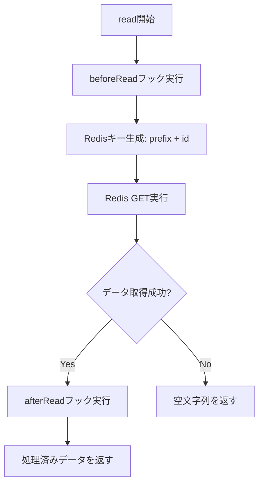
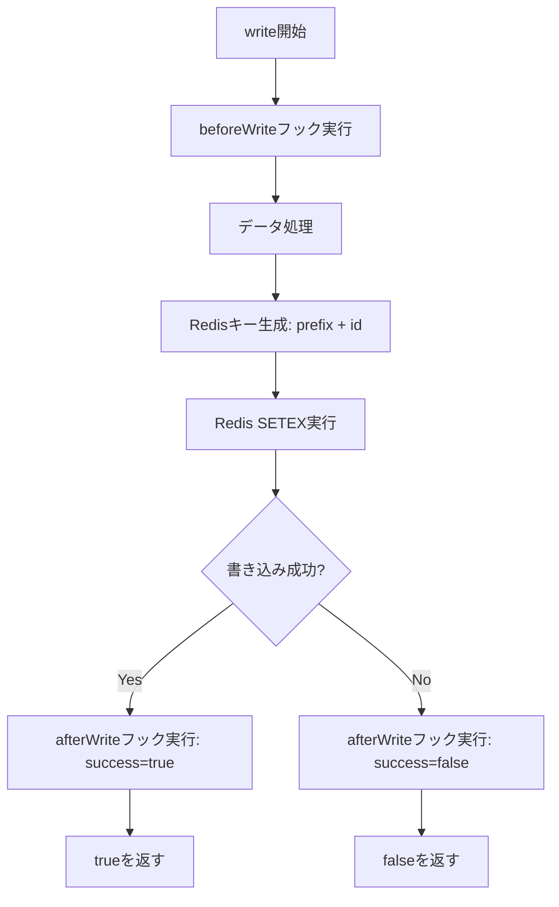

# 機能仕様書

## 1. 概要

enhanced-redis-session-handler.phpは、PHPのセッション管理をRedis/ValKeyを使用して実装する拡張可能なライブラリです。本仕様書では、各機能の詳細な動作、インターフェース、使用例を定義します。

## 1.1 例外クラス階層

このライブラリでは、エラー処理のために独自の例外クラス階層を定義します。すべての例外は`RuntimeException`を継承しています。

### 1.1.1 例外クラス定義

```php
namespace Uzulla\EnhancedRedisSessionHandler\Exception;

/**
 * ベース例外クラス
 * すべてのライブラリ固有の例外の基底クラス
 */
class RedisSessionException extends \RuntimeException
{
}

/**
 * Redis接続エラー
 * Redis/ValKeyサーバーへの接続に失敗した場合にスローされます
 */
class ConnectionException extends RedisSessionException
{
}

/**
 * Redis操作エラー
 * Redis/ValKeyへの操作（GET, SET, DELETEなど）が失敗した場合にスローされます
 */
class OperationException extends RedisSessionException
{
}

/**
 * セッションデータエラー
 * セッションデータの読み込み、書き込み、シリアライズ、デシリアライズに失敗した場合にスローされます
 */
class SessionDataException extends RedisSessionException
{
}

/**
 * 設定エラー
 * 不正な設定値や必須パラメータの欠如などの設定関連エラー
 */
class ConfigurationException extends RedisSessionException
{
}

/**
 * フックエラー
 * ReadHook/WriteHookの実行中にエラーが発生した場合にスローされます
 */
class HookException extends RedisSessionException
{
}
```

### 1.1.2 例外の使用例

```php
use Uzulla\EnhancedRedisSessionHandler\Exception\ConnectionException;
use Uzulla\EnhancedRedisSessionHandler\Exception\OperationException;

try {
    $connection = new RedisConnection([
        'host' => 'localhost',
        'port' => 6379,
    ]);
    $connection->connect();
} catch (ConnectionException $e) {
    // 接続エラーの処理
    error_log('Redis connection failed: ' . $e->getMessage());
    // フォールバック処理（例：ファイルベースのセッションに切り替え）
} catch (RedisSessionException $e) {
    // その他のライブラリエラーの処理
    error_log('Redis session error: ' . $e->getMessage());
}
```

### 1.1.3 例外スロー方針

- **ConnectionException**: Redis/ValKey接続失敗時、認証失敗時
- **OperationException**: Redis操作（GET, SET, DELETE等）失敗時
- **SessionDataException**: データのシリアライズ/デシリアライズ失敗時、データ破損検出時
- **ConfigurationException**: 不正な設定値、必須パラメータ欠如時
- **HookException**: フック実行中の予期しないエラー

**注意**: SessionHandlerInterfaceのメソッド（open, close, read, write, destroy, gc）は、例外をスローする代わりに`false`を返すことでエラーを示すことが推奨されます。例外は、回復不可能な重大なエラーの場合にのみスローします。

## 2. セッションハンドラ基本機能

### 2.1 SessionHandlerInterface実装

#### 2.1.1 open()

**シグネチャ:**
```php
public function open(string $path, string $name): bool
```

**目的:** セッションストレージを初期化します。

**パラメータ:**
- `$path`: セッション保存パス（このハンドラでは使用しない）
- `$name`: セッション名

**戻り値:**
- `true`: 初期化成功
- `false`: 初期化失敗

**動作:**
1. Redis接続が確立されていない場合、接続を試みる
2. 接続に成功したら`true`を返す
3. 接続に失敗したらエラーログを記録し`false`を返す

**例外:**
- 回復不可能な接続エラー時に`ConnectionException`をスローする可能性あり

#### 2.1.2 close()

**シグネチャ:**
```php
public function close(): bool
```

**目的:** セッションストレージを閉じます。

**戻り値:**
- `true`: 常に成功

**動作:**
1. Redis接続は維持する（接続プーリングのため）
2. 内部状態をクリーンアップ
3. `true`を返す

#### 2.1.3 read()

**シグネチャ:**
```php
public function read(string $id): string|false
```

**目的:** セッションデータを読み込みます。

**パラメータ:**
- `$id`: セッションID

**戻り値:**
- `string`: セッションデータ（シリアライズされた文字列）
- `false`: セッションが存在しない、または読み込み失敗

**動作フロー:**


**詳細動作:**
1. 全ての`beforeRead`フックを実行
2. キー名を生成: `{prefix}{sessionId}`
3. `RedisConnection::get()`でデータを取得
4. データが存在する場合、全ての`afterRead`フックを実行
5. 処理済みデータを返す
6. データが存在しない場合、空文字列を返す

**エラーハンドリング:**
- Redis接続エラー: ログ記録後、`false`を返す
- データ破損: ログ記録後、空文字列を返す

#### 2.1.4 write()

**シグネチャ:**
```php
public function write(string $id, string $data): bool
```

**目的:** セッションデータを書き込みます。

**パラメータ:**
- `$id`: セッションID
- `$data`: セッションデータ（シリアライズされた文字列）

**戻り値:**
- `true`: 書き込み成功
- `false`: 書き込み失敗

**動作フロー:**


**詳細動作:**
1. 全ての`beforeWrite`フックを実行してデータを処理
2. キー名を生成: `{prefix}{sessionId}`
3. TTLを計算（`session.gc_maxlifetime`から取得）
4. `RedisConnection::set()`でデータを保存（TTL付き）
5. 全ての`afterWrite`フックを実行
6. 結果を返す

**TTL設定:**
- デフォルト: `ini_get('session.gc_maxlifetime')`
- 最小値: 60秒
- 最大値: 設定による制限なし

#### 2.1.5 destroy()

**シグネチャ:**
```php
public function destroy(string $id): bool
```

**目的:** セッションを削除します。

**パラメータ:**
- `$id`: セッションID

**戻り値:**
- `true`: 削除成功
- `false`: 削除失敗

**動作:**
1. キー名を生成: `{prefix}{sessionId}`
2. `RedisConnection::delete()`でキーを削除
3. 結果を返す

**注意:**
- 存在しないキーの削除も成功として扱う

#### 2.1.6 gc()

**シグネチャ:**
```php
public function gc(int $max_lifetime): int|false
```

**目的:** 期限切れセッションのガベージコレクションを実行します。

**パラメータ:**
- `$max_lifetime`: セッションの最大有効期間（秒）

**戻り値:**
- `int`: 削除されたセッション数
- `false`: 失敗

**動作:**
1. RedisのTTL機能により自動的に期限切れキーが削除される
2. 明示的なガベージコレクションは不要
3. `0`を返す（削除数は追跡しない）

**注意:**
- RedisのTTL機能に依存するため、効率的
- 必要に応じて、`SCAN`コマンドで期限切れキーを検索する実装も可能

### 2.2 SessionUpdateTimestampHandlerInterface実装

#### 2.2.1 validateId()

**シグネチャ:**
```php
public function validateId(string $id): bool
```

**目的:** セッションIDが有効かどうかを検証します。

**パラメータ:**
- `$id`: セッションID

**戻り値:**
- `true`: セッションが存在する
- `false`: セッションが存在しない

**動作:**
1. キー名を生成: `{prefix}{sessionId}`
2. `RedisConnection::exists()`でキーの存在を確認
3. 結果を返す

#### 2.2.2 updateTimestamp()

**シグネチャ:**
```php
public function updateTimestamp(string $id, string $data): bool
```

**目的:** セッションのタイムスタンプを更新します（TTLを延長）。

**パラメータ:**
- `$id`: セッションID
- `$data`: セッションデータ（使用しない）

**戻り値:**
- `true`: 更新成功
- `false`: 更新失敗

**動作:**
1. キー名を生成: `{prefix}{sessionId}`
2. TTLを計算
3. `RedisConnection::expire()`でTTLを更新
4. 結果を返す

**最適化:**
- データの再書き込みを避け、TTLのみを更新

## 3. セッションIDジェネレータ機能

### 3.1 SessionIdGeneratorInterface

**目的:** セッションID生成ロジックをプラグイン可能にします。

**インターフェース定義:**
```php
namespace Uzulla\EnhancedRedisSessionHandler\SessionId;

interface SessionIdGeneratorInterface
{
    public function generate(): string;
}
```

### 3.2 DefaultSessionIdGenerator

**実装:**
```php
class DefaultSessionIdGenerator implements SessionIdGeneratorInterface
{
    public function generate(): string
    {
        return bin2hex(random_bytes(16));
    }
}
```

**特徴:**
- PHPの`random_bytes()`を使用
- 32文字の16進数文字列を生成（16バイトのランダムデータを16進数エンコード）
- 暗号学的に安全な乱数生成

**セキュリティレベル:** 標準

**注意事項:**
- この実装は参考実装であり、32文字（16バイト）のセッションIDを生成します
- PHPの`session.sid_length`設定は最大256文字まで対応していますが、この実装では32文字を使用しています
- より長いセッションIDが必要な場合は、`SecureSessionIdGenerator`を使用するか、独自の実装を作成してください
- セッションIDの長さは、セキュリティ要件とパフォーマンスのバランスを考慮して決定してください

### 3.3 SecureSessionIdGenerator

**実装:**
```php
class SecureSessionIdGenerator implements SessionIdGeneratorInterface
{
    private int $length;

    public function __construct(int $length = 32)
    {
        $this->length = $length;
    }

    public function generate(): string
    {
        return bin2hex(random_bytes($this->length));
    }
}
```

**特徴:**
- カスタマイズ可能な長さ
- デフォルト32バイト（64文字の16進数）
- より高いエントロピー

**セキュリティレベル:** 高

### 3.4 使用例

```php
use Uzulla\EnhancedRedisSessionHandler\RedisSessionHandler;
use Uzulla\EnhancedRedisSessionHandler\SessionId\SecureSessionIdGenerator;

$handler = new RedisSessionHandler($connection, [
    'id_generator' => new SecureSessionIdGenerator(48),
]);
```

### 3.5 カスタム実装例

```php
class UuidSessionIdGenerator implements SessionIdGeneratorInterface
{
    public function generate(): string
    {
        return sprintf(
            '%04x%04x-%04x-%04x-%04x-%04x%04x%04x',
            mt_rand(0, 0xffff), mt_rand(0, 0xffff),
            mt_rand(0, 0xffff),
            mt_rand(0, 0x0fff) | 0x4000,
            mt_rand(0, 0x3fff) | 0x8000,
            mt_rand(0, 0xffff), mt_rand(0, 0xffff), mt_rand(0, 0xffff)
        );
    }
}
```

### 3.6 UserSessionIdGenerator

**目的:** ユーザーIDをプレフィックスとしたセッションID生成により、ユーザー単位のセッション管理を実現します。

**実装:**
```php
class UserSessionIdGenerator implements SessionIdGeneratorInterface
{
    private ?string $userId = null;
    private int $randomLength;
    private string $anonymousPrefix;

    public function __construct(int $randomLength = 32, string $anonymousPrefix = 'anon')
    {
        // バリデーションロジック
        $this->randomLength = $randomLength;
        $this->anonymousPrefix = $anonymousPrefix;
    }

    public function generate(): string
    {
        $randomPart = bin2hex(random_bytes($this->randomLength / 2));

        if ($this->userId !== null) {
            return 'user' . $this->userId . '_' . $randomPart;
        }

        return $this->anonymousPrefix . '_' . $randomPart;
    }

    public function setUserId(string $userId): void;
    public function getUserId(): ?string;
    public function hasUserId(): bool;
    public function clearUserId(): void;
}
```

**特徴:**
- **匿名セッション**: ユーザーID未設定時は `anon_{random}` 形式
- **ユーザーセッション**: ユーザーID設定後は `user{userId}_{random}` 形式
- **セッションフィクセーション対策**: ログイン時にsetUserId()とsession_regenerate_id()を実行
- **ユーザー単位の管理**: セッションIDパターンでユーザーのセッションを特定可能

**セキュリティレベル:** 高（ログイン時のセッションID再生成必須）

**バリデーション:**
- `$userId`: 英数字、ハイフン、アンダースコアのみ、64文字以下
- `$userId`: 予約語（`anon`, `user`）で始まらない
- `$randomLength`: 16以上256以下の偶数
- `$anonymousPrefix`: 英数字とハイフンのみ、64文字以下

**使用例:**
```php
use Uzulla\EnhancedRedisSessionHandler\SessionId\UserSessionIdGenerator;
use Uzulla\EnhancedRedisSessionHandler\UserSessionHelper;

// 1. セッションハンドラの設定
$generator = new UserSessionIdGenerator();
$handler = new RedisSessionHandler($connection, [
    'id_generator' => $generator,
]);
session_set_save_handler($handler, true);

// 2. 匿名セッション開始
session_start();
// セッションID: anon_abc123...

// 3. ログイン時にユーザーIDを設定
$helper = new UserSessionHelper($generator, $connection, $logger);
$helper->setUserIdAndRegenerate('123');
// セッションID: user123_def456... (自動的に再生成)

// 4. 管理機能: 特定ユーザーの全セッション削除
$deletedCount = $helper->forceLogoutUser('123');

// 5. セッション監査
$sessions = $helper->getUserSessions('123');
$count = $helper->countUserSessions('123');
```

**詳細仕様:** `doc/UserSessionIdGenerator/design.md` を参照

## 3.7 ユーザーセッション管理機能（UserSessionHelper）

**目的:** UserSessionIdGeneratorと連携して、ユーザー単位のセッション管理機能を提供します。

**クラス定義:**
```php
namespace Uzulla\EnhancedRedisSessionHandler;

class UserSessionHelper
{
    public function __construct(
        UserSessionIdGenerator $generator,
        RedisConnection $connection,
        LoggerInterface $logger
    );

    public function setUserIdAndRegenerate(string $userId): bool;
    public function forceLogoutUser(string $userId): int;
    public function getUserSessions(string $userId): array;
    public function countUserSessions(string $userId): int;
}
```

### 3.7.1 setUserIdAndRegenerate()

**目的:** ログイン時にユーザーIDを設定し、セッションIDを再生成します。

**シグネチャ:**
```php
public function setUserIdAndRegenerate(string $userId): bool
```

**動作:**
1. 現在のセッションIDを取得
2. `UserSessionIdGenerator::setUserId()`でユーザーIDを設定
3. `session_regenerate_id(true)`でセッションIDを再生成
4. 新旧セッションIDをログに記録（マスキング済み）

**戻り値:**
- `true`: 成功
- `false`: 失敗（セッションIDが取得できない、再生成失敗）

**セキュリティ上の重要性:**
- セッションフィクセーション攻撃を防ぐため、ログイン成功時に必ず実行すること
- 古いセッションID（anon_xxx）は自動的に削除される
- 新しいセッションID（user123_xxx）は予測不可能

### 3.7.2 forceLogoutUser()

**目的:** 特定ユーザーの全セッションを強制削除します。

**シグネチャ:**
```php
public function forceLogoutUser(string $userId): int
```

**動作:**
1. `user{userId}_*` パターンでRedisキーを検索（SCAN使用）
2. 検出された全セッションキーを削除
3. 削除数をログに記録

**戻り値:** 削除されたセッション数

**用途:**
- セキュリティインシデント発生時の緊急対応
- パスワード変更時の他デバイスからのログアウト
- 管理者による強制ログアウト

**注意事項:**
- 本番環境でのブロッキングを避けるため、KEYSコマンドではなくSCANコマンドを使用
- 呼び出し前に必ず権限チェックを実施すること

### 3.7.3 getUserSessions()

**目的:** 特定ユーザーのアクティブセッション一覧を取得します。

**シグネチャ:**
```php
public function getUserSessions(string $userId): array
```

**戻り値:**
```php
[
    'user123_abc...' => [
        'session_id' => '..._abc',  // マスキング済み
        'data_size' => 256          // バイト数
    ],
    // ...
]
```

**用途:**
- セッション監査
- アクティブデバイスの確認
- セキュリティダッシュボード

### 3.7.4 countUserSessions()

**目的:** 特定ユーザーのアクティブセッション数を取得します。

**シグネチャ:**
```php
public function countUserSessions(string $userId): int
```

**戻り値:** セッション数

**用途:**
- セッション数制限の実装
- 統計情報の収集
- 不正アクセス検知

### 3.7.5 セキュリティ考慮事項

1. **権限チェック必須**
   ```php
   // 悪い例
   $helper->forceLogoutUser($_GET['user_id']); // 危険！

   // 良い例
   if (!$currentUser->isAdmin()) {
       throw new UnauthorizedException();
   }
   $helper->forceLogoutUser($targetUserId);
   ```

2. **セッションIDのマスキング**
   - 全てのログ出力でSessionIdMasker::mask()を自動適用
   - getUserSessions()の戻り値も自動的にマスキング済み

3. **タイミング攻撃対策**
   - forceLogoutUser()は存在しないユーザーでも同じ処理時間

4. **Redis SCAN使用**
   - 本番環境でのブロッキングを避けるため、KEYSではなくSCANを使用
   - デフォルトのバッチサイズ: 100

## 4. 読み込み時フック機能

### 4.1 ReadHookInterface

**目的:** セッションデータの読み込み前後に処理を挿入します。

**インターフェース定義:**
```php
namespace Uzulla\EnhancedRedisSessionHandler\Hook;

interface ReadHookInterface
{
    public function beforeRead(string $sessionId): void;
    
    public function afterRead(string $sessionId, string $data): string;
}
```

### 4.2 beforeRead()

**目的:** セッションデータ読み込み前の処理

**パラメータ:**
- `$sessionId`: セッションID

**用途例:**
- アクセスログの記録
- セキュリティチェック
- デバッグ情報の出力

### 4.3 afterRead()

**目的:** セッションデータ読み込み後の処理

**パラメータ:**
- `$sessionId`: セッションID
- `$data`: 読み込まれたセッションデータ

**戻り値:**
- `string`: 処理後のセッションデータ

**用途例:**
- データの復号化
- データの検証
- データの変換

### 4.4 実装例: 復号化フック

```php
class DecryptionReadHook implements ReadHookInterface
{
    private string $key;

    public function __construct(string $key)
    {
        $this->key = $key;
    }

    public function beforeRead(string $sessionId): void
    {
    }

    public function afterRead(string $sessionId, string $data): string
    {
        if (empty($data)) {
            return $data;
        }

        $decrypted = openssl_decrypt(
            $data,
            'AES-256-CBC',
            $this->key,
            0,
            substr(hash('sha256', $sessionId), 0, 16)
        );

        return $decrypted !== false ? $decrypted : '';
    }
}
```

### 4.5 実装例: アクセスログフック

```php
class AccessLogReadHook implements ReadHookInterface
{
    private LoggerInterface $logger;

    public function __construct(LoggerInterface $logger)
    {
        $this->logger = $logger;
    }

    public function beforeRead(string $sessionId): void
    {
        $this->logger->info('Session read attempt', [
            'session_id' => $sessionId,
            'timestamp' => time(),
            'ip' => $_SERVER['REMOTE_ADDR'] ?? 'unknown',
        ]);
    }

    public function afterRead(string $sessionId, string $data): string
    {
        $this->logger->info('Session read completed', [
            'session_id' => $sessionId,
            'data_size' => strlen($data),
        ]);

        return $data;
    }
}
```

### 4.6 フックの登録

```php
$handler = new RedisSessionHandler($connection);
$handler->addReadHook(new DecryptionReadHook($encryptionKey));
$handler->addReadHook(new AccessLogReadHook($logger));
```

**実行順序:**
- `beforeRead`フックは登録順に実行
- `afterRead`フックは登録順に実行し、各フックの出力が次のフックの入力となる

## 5. 書き込み時フック機能

### 5.1 WriteHookInterface

**目的:** セッションデータの書き込み前後に処理を挿入します。

**インターフェース定義:**
```php
namespace Uzulla\EnhancedRedisSessionHandler\Hook;

interface WriteHookInterface
{
    public function beforeWrite(string $sessionId, string $data): string|false;
    
    public function afterWrite(string $sessionId, bool $success): void;
}
```

### 5.2 beforeWrite()

**目的:** セッションデータ書き込み前の処理

**パラメータ:**
- `$sessionId`: セッションID
- `$data`: 書き込むセッションデータ

**戻り値:**
- `string`: 処理後のセッションデータ
- `false`: 書き込みをキャンセルする場合

**動作:**
- 処理後のセッションデータを返すと、そのデータがRedisに書き込まれます
- `false`を返すと、セッションデータの書き込みがキャンセルされます
- 書き込みがキャンセルされた場合、`write()`メソッドは`false`を返します

**用途例:**
- データの暗号化
- データの圧縮
- データの検証
- 特定条件下での書き込み制御（例：読み取り専用モード、メンテナンスモード）
- データサイズ制限のチェック

### 5.3 afterWrite()

**目的:** セッションデータ書き込み後の処理

**パラメータ:**
- `$sessionId`: セッションID
- `$success`: 書き込み成功フラグ

**用途例:**
- 監査ログの記録
- 統計情報の更新
- 通知の送信

### 5.4 実装例: 暗号化フック

```php
class EncryptionWriteHook implements WriteHookInterface
{
    private string $key;

    public function __construct(string $key)
    {
        $this->key = $key;
    }

    public function beforeWrite(string $sessionId, string $data): string|false
    {
        if (empty($data)) {
            return $data;
        }

        $encrypted = openssl_encrypt(
            $data,
            'AES-256-CBC',
            $this->key,
            0,
            substr(hash('sha256', $sessionId), 0, 16)
        );

        return $encrypted !== false ? $encrypted : $data;
    }

    public function afterWrite(string $sessionId, bool $success): void
    {
    }
}
```

### 5.5 実装例: 圧縮フック

```php
class CompressionWriteHook implements WriteHookInterface
{
    private int $threshold;

    public function __construct(int $threshold = 1024)
    {
        $this->threshold = $threshold;
    }

    public function beforeWrite(string $sessionId, string $data): string|false
    {
        if (strlen($data) < $this->threshold) {
            return $data;
        }

        $compressed = gzcompress($data, 6);
        return $compressed !== false ? 'GZIP:' . $compressed : $data;
    }

    public function afterWrite(string $sessionId, bool $success): void
    {
    }
}
```

### 5.6 実装例: 監査ログフック

```php
use Uzulla\EnhancedRedisSessionHandler\Support\SessionIdMasker;

class AuditLogWriteHook implements WriteHookInterface
{
    private LoggerInterface $logger;

    public function __construct(LoggerInterface $logger)
    {
        $this->logger = $logger;
    }

    public function beforeWrite(string $sessionId, string $data): string|false
    {
        return $data;
    }

    public function afterWrite(string $sessionId, bool $success): void
    {
        $this->logger->info('Session write completed', [
            'session_id' => SessionIdMasker::mask($sessionId),
            'success' => $success,
            'timestamp' => time(),
            'ip' => $_SERVER['REMOTE_ADDR'] ?? 'unknown',
        ]);
    }
}
```

**セキュリティ注意**: ログに保存する場合、セッションIDは機密情報のため、必ず`SessionIdMasker::mask()`を使用してマスキングしてください。

### 5.7 実装例: 書き込みキャンセルフック

```php
class ReadOnlyModeWriteHook implements WriteHookInterface
{
    private bool $readOnlyMode;

    public function __construct(bool $readOnlyMode = false)
    {
        $this->readOnlyMode = $readOnlyMode;
    }

    public function beforeWrite(string $sessionId, string $data): string|false
    {
        if ($this->readOnlyMode) {
            // 読み取り専用モードの場合、書き込みをキャンセル
            error_log("Session write cancelled: read-only mode enabled (session_id: {$sessionId})");
            return false;
        }
        return $data;
    }

    public function afterWrite(string $sessionId, bool $success): void
    {
        // 書き込み後の処理（必要に応じて）
    }

    public function setReadOnlyMode(bool $enabled): void
    {
        $this->readOnlyMode = $enabled;
    }
}
```

**使用例:**
```php
$readOnlyHook = new ReadOnlyModeWriteHook();
$handler->addWriteHook($readOnlyHook);

// メンテナンスモードに入る
$readOnlyHook->setReadOnlyMode(true);

// この時点でのセッション書き込みはすべてキャンセルされる
$_SESSION['data'] = 'new value';
session_write_close(); // write()はfalseを返す

// メンテナンスモード終了
$readOnlyHook->setReadOnlyMode(false);
```

### 5.8 フックの登録

```php
$handler = new RedisSessionHandler($connection);
$handler->addWriteHook(new CompressionWriteHook(2048));
$handler->addWriteHook(new EncryptionWriteHook($encryptionKey));
$handler->addWriteHook(new AuditLogWriteHook($logger));
```

**実行順序:**
- `beforeWrite`フックは登録順に実行し、各フックの出力が次のフックの入力となる
- `afterWrite`フックは登録順に実行

## 6. エラーハンドリング仕様

### 6.1 エラーの種類

#### 6.1.1 接続エラー

**発生条件:**
- Redisサーバーに接続できない
- ネットワークタイムアウト
- 認証失敗

**処理:**
1. エラーログを記録（CRITICAL レベル）
2. 再接続を試みる（最大3回）
3. 失敗した場合、`ConnectionException`をスロー

**ログ例:**
```
[CRITICAL] Redis connection failed: Connection refused (host: localhost, port: 6379)
```

#### 6.1.2 操作エラー

**発生条件:**
- Redis操作の失敗（GET, SET, DELなど）
- メモリ不足
- キーの型が不正

**処理:**
1. エラーログを記録（ERROR レベル）
2. `false`を返す（PHPのセッションハンドラ仕様に準拠）
3. 次回の操作で再試行

**ログ例:**
```
[ERROR] Redis SET operation failed: OOM command not allowed when used memory > 'maxmemory'
```

#### 6.1.3 データエラー

**発生条件:**
- セッションデータの破損
- 不正なフォーマット
- 復号化失敗

**処理:**
1. エラーログを記録（ERROR レベル）
2. 空のセッションデータを返す
3. 新しいセッションとして扱う

**ログ例:**
```
[ERROR] Session data corrupted: Unable to decrypt data for session ID abc123
```

#### 6.1.4 設定エラー

**発生条件:**
- 不正な設定パラメータ
- 必須パラメータの欠落
- 型の不一致

**処理:**
1. 初期化時に`InvalidArgumentException`をスロー
2. エラーメッセージで問題を明示

**例:**
```php
throw new InvalidArgumentException('Redis host must be a non-empty string');
```

### 6.2 ログ出力仕様

#### 6.2.1 ログレベル

| レベル | 用途 | 例 |
|--------|------|-----|
| CRITICAL | システムが動作不能 | Redis接続失敗 |
| ERROR | 操作失敗、データ破損 | SET操作失敗 |
| WARNING | 警告、再試行 | 接続タイムアウト |
| INFO | 正常な操作 | セッション作成 |
| DEBUG | 詳細情報 | Redis操作の詳細 |

#### 6.2.2 ログフォーマット

```
[LEVEL] Message: Details (context: key=value, ...)
```

**例:**
```
[INFO] Session created (session_id: abc123, ttl: 1440)
[ERROR] Redis operation failed: Connection timeout (host: localhost, port: 6379, timeout: 2.5)
```

### 6.3 リトライ戦略

#### 6.3.1 接続リトライ

- 最大試行回数: 3回
- リトライ間隔: 100ms, 200ms, 400ms（指数バックオフ）
- タイムアウト: 各試行で2.5秒

#### 6.3.2 操作リトライ

- 基本的にリトライしない（PHPのセッションハンドラ仕様に準拠）
- 次回のリクエストで自動的に再試行される

## 7. 設定仕様

### 7.1 RedisConnection設定

```php
$config = [
    'host' => 'localhost',
    'port' => 6379,
    'timeout' => 2.5,
    'password' => null,
    'database' => 0,
    'prefix' => 'session:',
    'persistent' => false,
    'retry_interval' => 100,
    'read_timeout' => 2.5,
];
```

| パラメータ | 型 | デフォルト | 説明 |
|-----------|-----|-----------|------|
| host | string | 'localhost' | Redisサーバーのホスト名 |
| port | int | 6379 | Redisサーバーのポート番号 |
| timeout | float | 2.5 | 接続タイムアウト（秒） |
| password | string\|null | null | 認証パスワード |
| database | int | 0 | データベース番号（0-15） |
| prefix | string | 'session:' | キープレフィックス |
| persistent | bool | false | 永続的接続を使用 |
| retry_interval | int | 100 | リトライ間隔（ミリ秒） |
| read_timeout | float | 2.5 | 読み取りタイムアウト（秒） |

### 7.2 RedisSessionHandler設定

```php
$options = [
    'id_generator' => new DefaultSessionIdGenerator(),
    'max_lifetime' => null,
    'lock_timeout' => 30,
    'lock_retries' => 10,
];
```

| パラメータ | 型 | デフォルト | 説明 |
|-----------|-----|-----------|------|
| id_generator | SessionIdGeneratorInterface | DefaultSessionIdGenerator | セッションIDジェネレータ |
| max_lifetime | int\|null | null | セッション最大有効期間（秒、nullの場合はini設定を使用） |
| lock_timeout | int | 30 | セッションロックのタイムアウト（秒） |
| lock_retries | int | 10 | ロック取得の最大試行回数 |

## 8. パフォーマンス仕様

### 8.1 ベンチマーク目標

| 操作 | 目標レスポンスタイム | 備考 |
|------|---------------------|------|
| read() | < 5ms | 通常のセッションサイズ（< 10KB） |
| write() | < 10ms | 通常のセッションサイズ（< 10KB） |
| destroy() | < 5ms | - |
| validateId() | < 3ms | - |

### 8.2 スケーラビリティ目標

- 同時セッション数: 100,000+
- 秒間リクエスト数: 10,000+
- セッションデータサイズ: 最大1MB

### 8.3 最適化手法

1. **接続の再利用**: 同一リクエスト内でRedis接続を再利用
2. **パイプライン処理**: 将来的に複数操作をまとめて実行
3. **適切なTTL設定**: 不要なデータの自動削除
4. **圧縮**: 大きなセッションデータの圧縮（オプション）

## 9. セキュリティ仕様

### 9.1 セッションID生成

- **アルゴリズム**: `random_bytes()`（暗号学的に安全）
- **長さ**: 最低16バイト（32文字の16進数）
- **エントロピー**: 128ビット以上
- **文字セット**: 0-9, a-f（16進数）

### 9.2 セッション固定攻撃対策

```php
session_regenerate_id(true);
```

- ログイン時にセッションIDを再生成
- 権限変更時にセッションIDを再生成

### 9.3 セッションハイジャック対策

**推奨実装（ReadHookで実装）:**
```php
class SessionValidationReadHook implements ReadHookInterface
{
    public function beforeRead(string $sessionId): void
    {
    }

    public function afterRead(string $sessionId, string $data): string
    {
        if (empty($data)) {
            return $data;
        }

        $session = unserialize($data);
        
        if (isset($session['_ip']) && $session['_ip'] !== $_SERVER['REMOTE_ADDR']) {
            return '';
        }
        
        if (isset($session['_ua']) && $session['_ua'] !== $_SERVER['HTTP_USER_AGENT']) {
            return '';
        }
        
        return $data;
    }
}
```

### 9.4 データ暗号化

**推奨実装（WriteHook/ReadHookで実装）:**
- アルゴリズム: AES-256-CBC
- キー管理: 環境変数または専用のキー管理システム
- IV: セッションIDから派生

### 9.5 セッションIDのログ出力保護

セッションIDは機密情報であり、ログに記録すると漏洩時にセッションハイジャックのリスクがあります。ログ出力時には必ず`SessionIdMasker`を使用してマスキングすることが重要です。

#### 9.5.1 SessionIdMaskerユーティリティクラス

```php
namespace Uzulla\EnhancedRedisSessionHandler\Support;

class SessionIdMasker
{
    /**
     * セッションIDをマスキングして安全にログ出力できる形式に変換
     *
     * @param string $sessionId マスキングするセッションID
     * @return string マスキングされたセッションID（末尾4文字のみ表示）
     */
    public static function mask(string $sessionId): string
    {
        if (strlen($sessionId) <= 4) {
            return '...' . $sessionId;
        }
        return '...' . substr($sessionId, -4);
    }
}
```

#### 9.5.2 使用例

```php
use Uzulla\EnhancedRedisSessionHandler\Support\SessionIdMasker;

// ログ出力時にマスキング
$logger->info('Session read', [
    'session_id' => SessionIdMasker::mask($sessionId),
    'data_size' => strlen($data),
]);

// 例: "abc123def456" → "...f456"
```

#### 9.5.3 セキュリティ上の理由

- **漏洩リスク**: ログファイルが漏洩した場合、完全なセッションIDがあるとセッションハイジャックが可能
- **デバッグ可能性**: 末尾4文字のみ表示することで、同一セッションの相関分析は可能
- **自動適用**: すべての組み込みフック（LoggingHook、DoubleWriteHook、ReadTimestampHook等）は自動的にマスキングを適用

**重要**: 本番環境では絶対に生のセッションIDをログに記録しないでください。

## 10. テスト仕様

### 10.1 ユニットテストカバレッジ目標

- コードカバレッジ: 90%以上
- ブランチカバレッジ: 85%以上

### 10.2 テストケース

#### 10.2.1 基本操作テスト

- セッションの作成
- セッションの読み込み
- セッションの更新
- セッションの削除
- ガベージコレクション

#### 10.2.2 エラーケーステスト

- Redis接続失敗
- 操作失敗
- データ破損
- タイムアウト

#### 10.2.3 フック機能テスト

- ReadHookの実行順序
- WriteHookの実行順序
- フックのデータ変換
- フックのエラーハンドリング

#### 10.2.4 統合テスト

- 実際のRedis接続を使用
- セッションのライフサイクル全体
- 複数のフックの組み合わせ
- 同時アクセス

### 10.3 パフォーマンステスト

- 大量のセッション操作
- 同時接続数のテスト
- メモリ使用量の監視
- レスポンスタイムの測定

## 11. 使用例

### 11.1 基本的な使用例

```php
<?php
use Uzulla\EnhancedRedisSessionHandler\RedisSessionHandler;
use Uzulla\EnhancedRedisSessionHandler\RedisConnection;

$connection = new RedisConnection([
    'host' => 'localhost',
    'port' => 6379,
    'prefix' => 'myapp:session:',
]);

$handler = new RedisSessionHandler($connection);
session_set_save_handler($handler, true);
session_start();

$_SESSION['user_id'] = 123;
$_SESSION['username'] = 'john_doe';
```

### 11.2 カスタムセッションIDジェネレータの使用

```php
use Uzulla\EnhancedRedisSessionHandler\SessionId\SecureSessionIdGenerator;

$handler = new RedisSessionHandler($connection, [
    'id_generator' => new SecureSessionIdGenerator(48),
]);
```

### 11.3 暗号化フックの使用

```php
use Uzulla\EnhancedRedisSessionHandler\Hook\EncryptionWriteHook;
use Uzulla\EnhancedRedisSessionHandler\Hook\DecryptionReadHook;

$encryptionKey = getenv('SESSION_ENCRYPTION_KEY');

$handler = new RedisSessionHandler($connection);
$handler->addWriteHook(new EncryptionWriteHook($encryptionKey));
$handler->addReadHook(new DecryptionReadHook($encryptionKey));

session_set_save_handler($handler, true);
session_start();
```

### 11.4 複数フックの組み合わせ

```php
$handler = new RedisSessionHandler($connection);

$handler->addWriteHook(new CompressionWriteHook(2048));
$handler->addWriteHook(new EncryptionWriteHook($encryptionKey));
$handler->addWriteHook(new AuditLogWriteHook($logger));

$handler->addReadHook(new DecryptionReadHook($encryptionKey));
$handler->addReadHook(new DecompressionReadHook());
$handler->addReadHook(new AccessLogReadHook($logger));

session_set_save_handler($handler, true);
session_start();
```

## 12. まとめ

本仕様書では、enhanced-redis-session-handler.phpの全機能について詳細に定義しました。この仕様に基づいて実装することで、拡張性が高く、セキュアで、パフォーマンスの良いセッションハンドラを実現できます。

各機能は独立して実装・テスト可能であり、段階的な開発が可能です。プラグイン機構とフック機能により、将来的な機能追加も容易に行えます。
